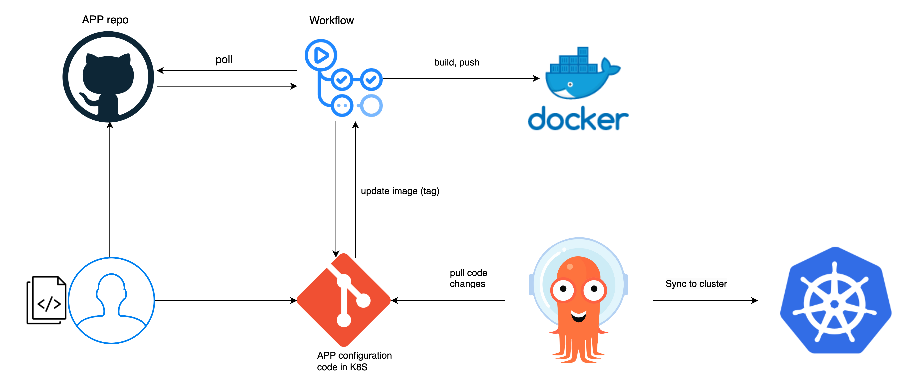
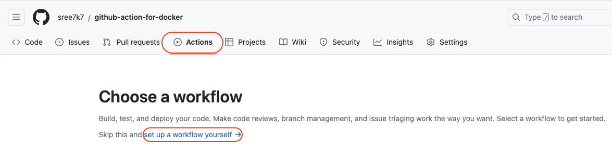
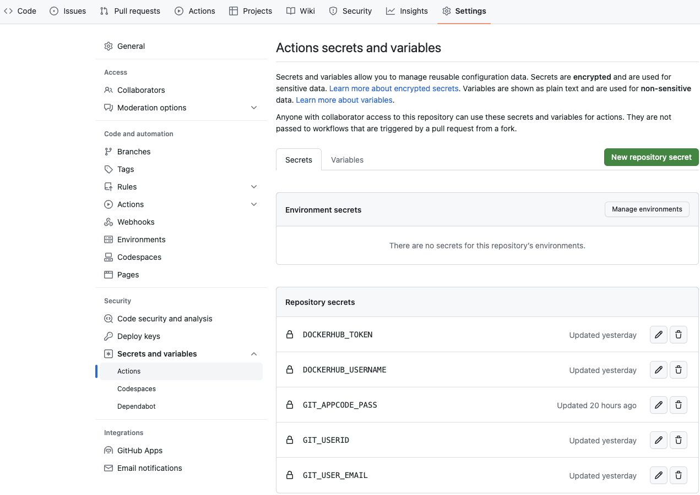

# Deploy automated kubernetes cluster with ArgoCD using GitOps, GitHub actions

## Run
  - [Purpose](#purpose)
  - [Prerequsites](#prerequsites)
  - [Repository](#repository)
  - [Github secrets](#github-secrets)
  - [Install Argocd](#install-argocd)
    - [Login in to Argo CD UI](#login-in-to-argo-cd-ui-user-interface) 
    - [ArgoCD application manifest file](#argocd-application-manifest-file)
  - [Workflow](#workflow)
  - [Clean up](#clean-up)

## Purpose

Create a fully automated CI/CD pipeline with argocd in kubernetes using GitHub and GitOps.


## Prerequsites

- [argocd](https://argo-cd.readthedocs.io/en/stable/getting_started/).
- [GitHub Actions](https://docs.docker.com/build/ci/github-actions/)
- [kind](https://kind.sigs.k8s.io/docs/user/quick-start/) or [minikube](https://kubernetes.io/docs/tutorials/kubernetes-basics/create-cluster/cluster-intro/).
- [docker](https://www.docker.com/), [docker push](https://docs.docker.com/engine/reference/commandline/push/).

## Repository 

1. Create a github repository (**app-configuration-code**) and clone the repo (means empty repo). 
    - Keep your k8s deployment code in this repo.
2. After cloning, create folder `dev`. Add your configuration manifest file ([deployment.yaml](k8s-deploy/deployment.yaml)).
3. Create a github repository (**app-source-code**) and clone the repo (means empty repo). Add your application code ([web-app.html](web-app.html)).
4. Create the workflow with GitHub actions on repo: *app-source-code*
    - Go to → repository: *app-source-code* on GitHub and then select the **Actions** tab.
    - Select set up a workflow yourself. It will create GitHub actions `.github/workflows/main.yml`

    - Add [code](.github/workflows/main.yml) to mail.yaml file.
    - change the necessary env variable in [main.yaml](.github/workflows/main.yml):
    ```bash
    env:
    image_name: <imagename> # the tag is will create automatically in deployment.yaml
    github_repo: <github repo name> # k8s delpoyment code i,e repository name created in step 1.
    deploy_path: <path of manifest file> # e.g: /k8s-deploy/deployment.yaml
    ```

5. Later, push the code to repository :octocat:.

> Note: Before you push the code, pull the code as the deployment `image:tag` is updated by GitHub actions.

### Github secrets

Create necessary (*desired*) secrets to access tokens, userId's, email etx!

#### DockerHub Token

1. Sign in to **Docker Hub**.

2. Select your **username** in the top-right corner and from the drop-down menu select **Account Settings**.

3. Click the **Security** tab and then **New Access Token**. copy token.

4. In GitHub, Goto → repo → setting → click: Secrets and variables → click: New repository secret (Name: *DOCKERHUB_TOKEN* and Secret: copy step 3 token).

#### DockerHub username
1. In GitHub, Goto → repo → setting → click: Secrets and variables → click: New repository secret (Name: *DOCKERHUB_USERNAME* and Secret: <dockerhub_username>).

#### GitHub userID

1. In GitHub, Goto → repo → setting → click: Secrets and variables → click: New repository secret (Name: *GIT_USERID* and Secret: <github_username>).

#### GitHub user email
1. In GitHub, Goto → repo → setting → click: Secrets and variables → click: New repository secret (Name: *GIT_USER_EMAIL* and Secret: <github_email>).


#### GitHub passwd ([Fine-grained personal access tokens](https://docs.github.com/en/authentication/keeping-your-account-and-data-secure/managing-your-personal-access-tokens))

1. In GitHub, Select your username in the top-right corner and from the drop-down menu select **Settings**.

2. On left pane → click: Developer setting → personal access tokens → Fine-grained tokens → Generate new token → give details: token name, expire, select repo, generate token. Copy token (used in step 3).

3. In GitHub, Goto → select: repo → setting → click: Secrets and variables → click: New repository secret (Name: *GIT_PASS* and Secret: <copy token from step 3>).

4. Set your [permissions](https://docs.github.com/en/rest/overview/permissions-required-for-fine-grained-personal-access-tokens?apiVersion=2022-11-28).

## Install Argocd

To install argocd agent with stable version, execute the following command in your cluster.

```
kubectl create namespace argocd
kubectl apply -n argocd -f https://raw.githubusercontent.com/argoproj/argo-cd/stable/manifests/install.yaml
```
or

- kubectl create -f [install.yaml](install.yaml)

### Login in to Argo CD UI (user interface)

One of the ways: 
- Port forwarding

`kubectl port-forward svc/argocd-server -n argocd 8080:443`

In browser enter the → http://127.0.0.1:8080

user name: *`admin`* 

password::white_check_mark:

```bash
kubectl -n argocd get secret argocd-initial-admin-secret -o yaml
# after getting the passwd, decode it!
echo -n "ODkxc3dmSHdyeUZxxxxx==" | base64 --decode
```

### ArgoCD application manifest file:

Execute the below code in cluster for [application](https://argo-cd.readthedocs.io/en/stable/operator-manual/declarative-setup/) spec for argocd.

> **Note**: Update the parameters:
- repoURL (giturl) and 
- path (github folder)
- server: (cluster endpoint)
- namespace

```bash
apiVersion: argoproj.io/v1alpha1
kind: Application
metadata:
  name: myapp-argo-application
  namespace: argocd
  labels:
    name: myapp-argo-application
  finalizers:
    # The default behaviour is foreground cascading deletion. It delete both the app and it's resource.
    - resources-finalizer.argocd.argoproj.io
spec:
  project: default # default namespace. i.e, your deployment created in default namespace
  source:
    repoURL: https://github.com/<gituserid>/repo #github repo url
    targetRevision: HEAD
    path: <folder> #e.g dev-env #git folder, where the code lies.
  destination:
    server: https://kubernetes.default.svc
    namespace: default
# if you don't have namespace, use create Namespace=true syncpolicy config
  syncPolicy:
    syncOptions:
    - CreateNamespace=true
    # changes made to cluster to sync github, argoCD will see the changes made in manifest file
    automated:
      selfHeal: true
      prune: true # trim. if the resources should be pruned during auto-syncing.
```

Create the changes with kubectl:

- kubectl create -f [application.yaml](application-argocd/application.yaml)

Any updates and changes:
`kubectl replace -f application.yaml --force`

## workflow

Use the [main.yaml](.github/workflows/main.yml) and change the default. 

If you have mulitple repos:

- Change the custom script with below code:

As the code will connect to: github_repo: <github repo name> # k8s delpoyment code, using the [PAT](https://docs.github.com/en/authentication/keeping-your-account-and-data-secure/managing-your-personal-access-tokens)

```
      - # --- script to push the image tag in configuration code ----
        name: Custom script
        run: |

         #!/bin/bash
         git config user.email ${{ secrets.GIT_USER_EMAIL }}
         git config user.name ${{ secrets.GIT_USERID }}
         git clone https://${{ secrets.DOCKERHUB_USERNAME }}:${{ secrets.GIT_APPCODE_PASS }}@github.com/${{ secrets.DOCKERHUB_USERNAME }}/${{ env.github_repo }}.git
         git pull
         cat .${{ env.deploy_path }}
         sed -i 's+${{ secrets.DOCKERHUB_USERNAME }}/*.*+${{ steps.meta.outputs.tags }}+g' .${{ env.deploy_path }}
         cat .${{ env.deploy_path }}
         git config user.email ${{ secrets.GIT_USER_EMAIL }}
         git config user.name ${{ secrets.GIT_USERID }}
         git add .
         git commit -m "version - ${{ steps.meta.outputs.tags }}"
         git push https://${{ secrets.GIT_USERID }}:${{ secrets.GIT_APPCODE_PASS }}@github.com/${{ secrets.DOCKERHUB_USERNAME }}/${{ env.github_repo }}.git
         
         echo "pushed code ${{ steps.meta.outputs.tags }}"
        shell: bash
```


## Clean up

In terminal execute the following command:

```docker
kubectl delete -n argocd -f https://raw.githubusercontent.com/argoproj/argo-cd/stable/manifests/install.yaml
```
To verify: in terminal execute, `kubectl get all -n argocd`

Expected result: `No resources found in argocd namespace`.